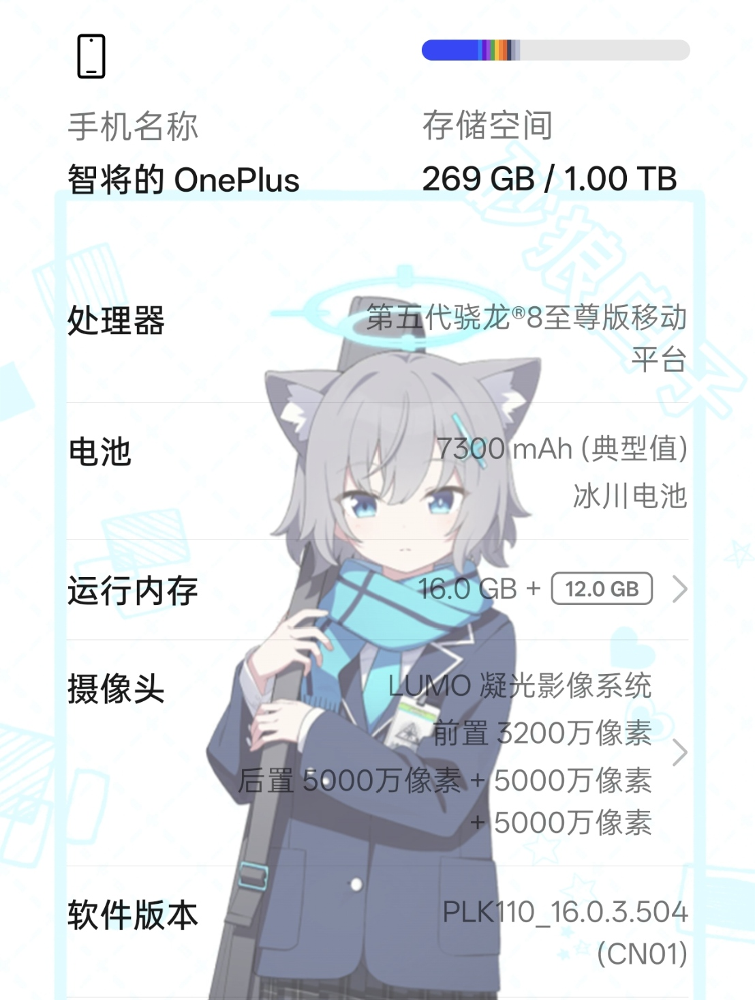
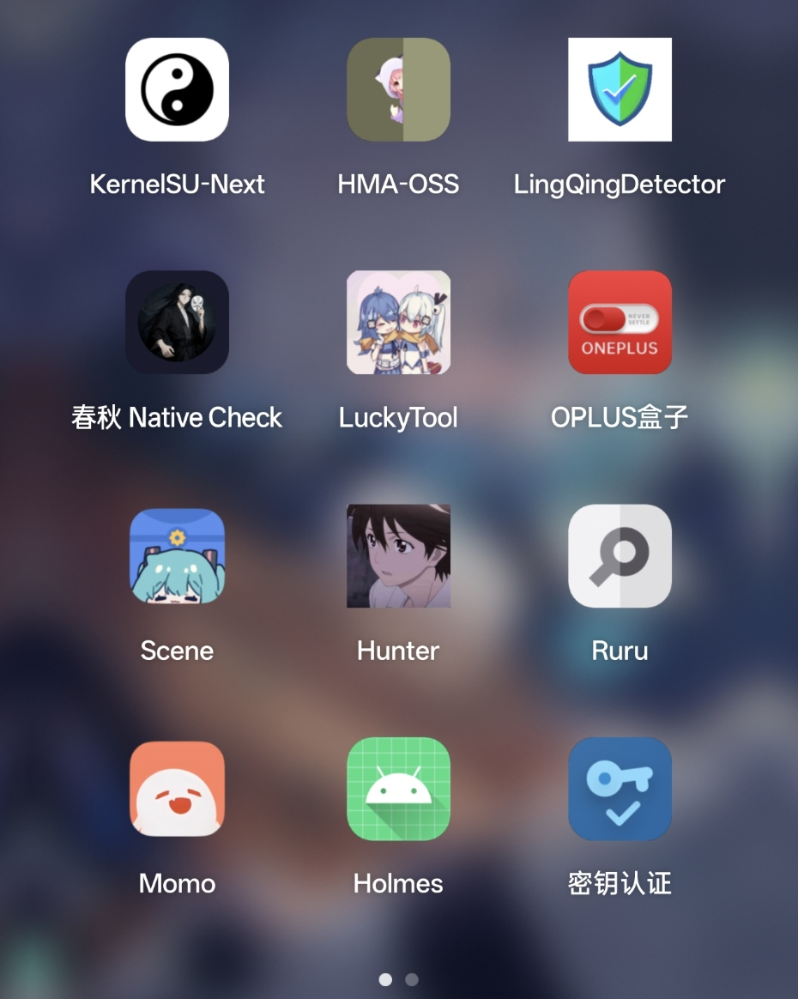
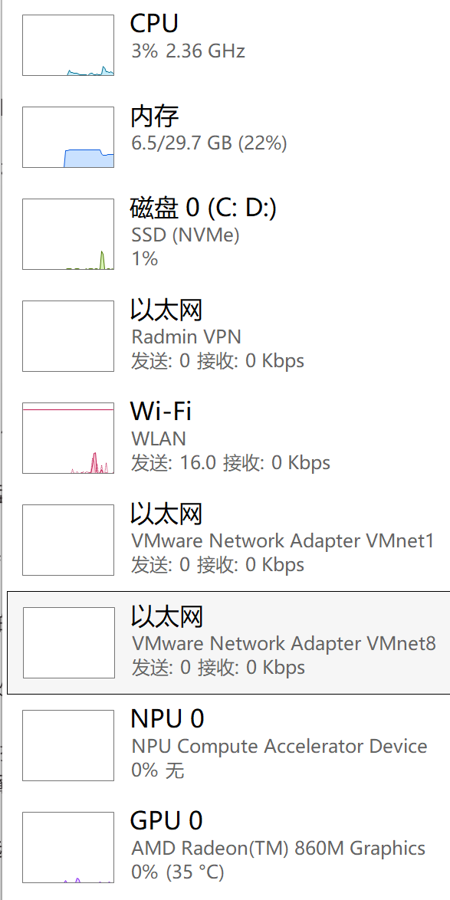
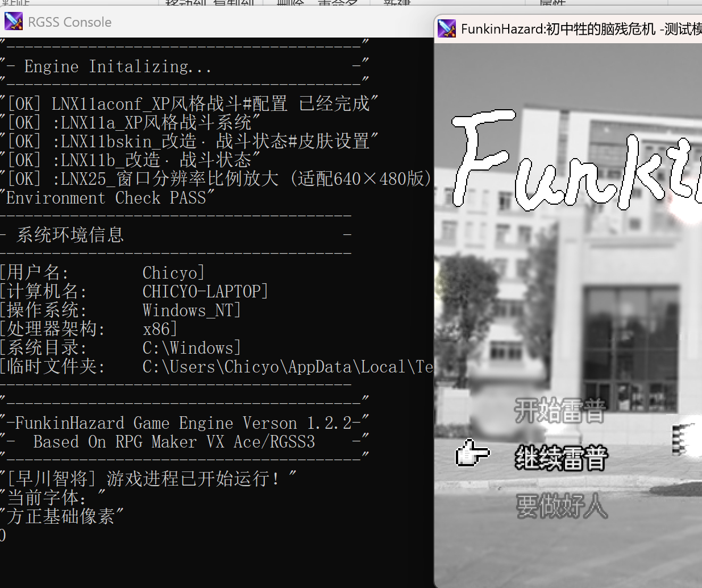
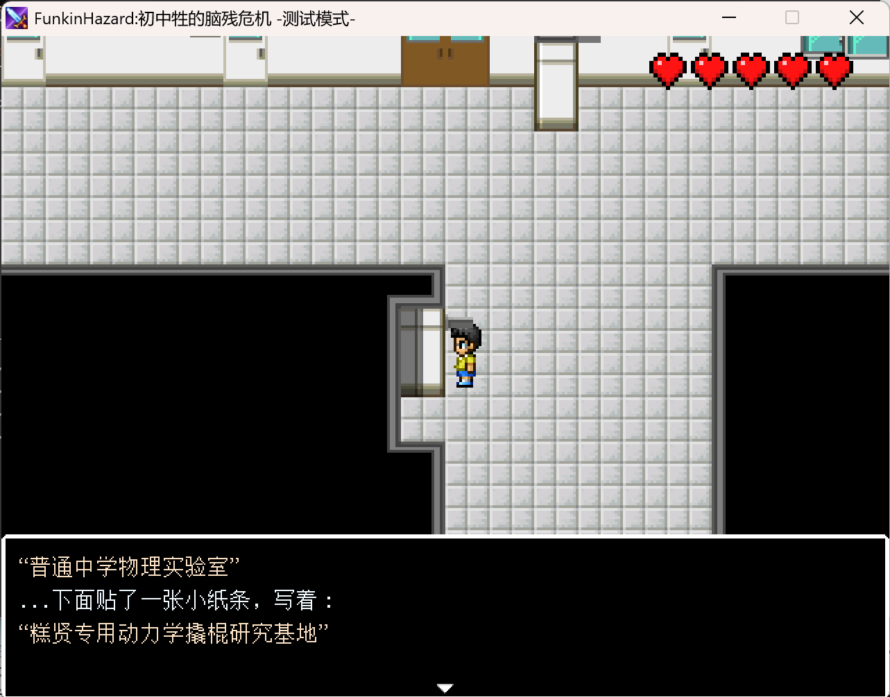
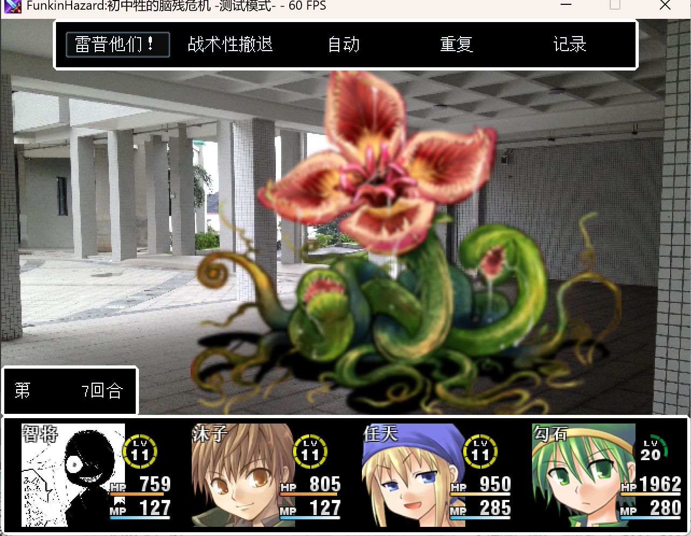

# 近期随笔

正好过去了两个月不是吗...?

这里正在适应FuwariStudio这个小众工具。

嗯...大抵如此吧，这两个月只能说是摆烂中的摆烂。

新设备都陆续收到了，游戏也复工了，虽然进度出乎意料的慢。

---
### 关于装备
#### 手机
vivo Y200 → OnePlus 15

虽然说相机缩肛了，但是怎么说也是个旗舰机，何况是我这种随手拍的家伙，以及整天拿着手机打游戏或者外出时对好兄弟们乱拍的...

骁龙8 Elite 5，怎么说也比之前的Y200的骁龙6 Gen1及内核级反root的步步高（~~不对啊，蓝厂绿厂最开始都是步步高的~~）原子系统强。

似乎买的早，所以三四千（3984）~~近乎骨折~~的价格~~（国补900）~~买下了这台机器。

是的, 16GB + 1TB 顶级配置。

比我兄弟的OPPO K13 Turbo Pro嘛...唯一差的是风扇。但是性能方面都算是薄纱了.

然而去完香港回到家之后脑子一热想整efisp假回锁，结果疑似操作不当直接触发反回滚了，送到郑州（期间傻傻的取消了原本到广州的订单）原厂维修中心去，免费换了个主板还有新水胶壳。在这里隆重表扬绿厂工程师。

所以在这里提醒一句，不要在没有十足把握的情况下搞这种高风险操作，更何况目前一加15的水管文件（Firehose）都没泄出。

折腾的话搞个KSUNext过春秋的方案就行，假回锁还是太高风险了。

这边是重新拿回机器之后先用了几天，等到深度测试通过之后立马解开了，因为大家都知道一加开始和它的上级一样，温水煮青蛙了（每月1日放名额，手慢无，9月份颜色OS17立马开始实行），所以不到这个情况我本来都不打算解锁这机器的。

如果这里真的有读者，那我还是贴个链接指一下路吧。

首先强制使用KSU方案，KernelSU和KernelSU-Next都可以。

要弄的大部分东西在@月虹yh 的个人分享页面都有（就是那个一键隐藏模块）

[过春秋设置详解](https://www.coolapk.com/feed/72184498?s=YWYwYzM0Y2UyNzg2MTBiZzZhNjNmZmE2ega1650 "过春秋设置详解")

[酷安@月虹yh的 分享页面](https://yhyun.asia/ "酷安@月虹yh的 分享页面")

[去广告模块](https://github.com/lingeringsound/10007 "去广告模块")

大概这样，如果看不懂的话，恕我不展开解释。

效果图，如图所示。如果说图片显示没有问题的话。

---
#### 电脑

老J1900工控板小主机 → Thinkbook 16 G8+ AGP(2026)

我只能说，虽然这机器性能确实实打实的比我已经遗失的主力机和原本的工控板好上不少，但是比起预期还是缩肛了。

~~因为嘛...家里亲戚本来是帮忙买的，说是直接帮忙拿下拯救者Y7000P，结果缩肛了，端水大师这一块😂~~

这机器是锐龙AI 7 H 450w，没有独立显卡（这机器的5060Ti版本，上万级别的），不过32GB超大运存，至少是以前做梦都能笑醒的。
LPDDR5 的32GB共享内存（划2GB专门给显卡），镭龙860M至少可以1080P窗口化运行鸣潮60帧（拉海洛学院广场的话就...嗯。）NPU跑个4B模型毫无压力，不过我不懂怎么搞定Agent，所以最后不了了之。

Minecraft可以流畅运行大型整合包，不过光影就无需指望了。YoFPS的High版本还是可以做考虑的。

3200x2000的分辨率，支持165Hz高刷，不过平时根本用不到（

1TB的存储空间，会被原厂的坑爹玩意吃掉一大堆，联想电脑管家（套了WebView的火绒阉割版），联想伪AI浏览器，天禧智障体,联想智会，联想超级互联（不如连接到Windows），推荐没有特殊需求可以直接用Geek Uninstaller一锅端，换成火绒官方6.0就好了。还想压缩存储的，右转CompactGUI吧。

SysMain这些服务调一调，搭配Mem Reduct定时清理，运存可以轻轻松松压到8.5GB（这是我开着Native【即旧版的】Windows QQ,微信【阉割小程序和浏览器组件】和写文章的玩意的占用，还有Steam）

~~但是还是望着兄弟的天选6Pro酷睿版及一堆其他来酷，雷神之类的设备拉出了泪...~~

因为有着理科的兴趣但是文科思维+选的也是半文不理的组合，所以大学报的是汉语言文学，说实在是为了学点写作技巧啥的...不过也不清楚（按专业老师说法是，电脑不会太常用，~~所以还是沦落为了生产力工具和游戏工具~~）

---

### 关于最近项目

#### FunkinHazard 1 开发情况

##### 在做了在做了...

也是最近修出了一堆神奇的诡异Bug，重新搭建了剧情播放系统和其他的东西。
和鲸鱼娘每天高强度对线至少半小时。
不得不说，自从可以看图了之后，她越来越好用了。
也是把之前的Splash导致的恶性标题bug修复了，原因是Splash和动态标题画面冲突。

只不过最近疑似奥密克戎变种二次中招，抑或是简单的上火（嗓子发炎）达到极点导致发烧了，有点衰弱。

简单的几张图片：

系统方面因为基底基于Bakahazard 1（逗比危机1 初始版），所以有大部分原有的敌人和敌群数据，这里再次膜拜至高无上的[nobina](https://space.bilibili.com/1939051/)大人。

总之正在全力克服拖延病开发中...

---

#### 终之空 原版 or RenPy 现代移植版 汉化

##### ？？？？？？

首先，上个月才了解到这款狂气向的哲学Gal，并了解到KeroQ和依旧不知道在想什么的扶她自...

这玩意真的是个难题（悲

游戏嘛，是Macromedia Director 7.x开发的（对的，开发了Flash然后被粘土收购的那个厂商）

这个软件想跑没问题，但是它居然是带加密狗的...哪怕我正好有个XP虚拟机环境都跑不了，只能安装移除硬件验证的8.5，然后打得开但是兼容性问题了（

